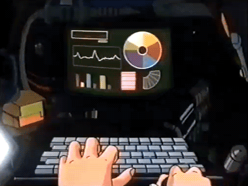

# ECAL_MID_2026 | CREATIVE CODING I

# DRAWING WITH CODE

> _Introduction au Creative Coding avec JavaScript_
> Grâce à des exercices pratiques, nous découvrirons comment utiliser le code pour créer des animations, des interactions et des effets visuels.
> Nous aborderons des concepts clés tels que les variables, les boucles, les fonctions et les objets, tout en les appliquant à des exercices réguliers.
> L'objectif est d'apprendre à penser de manière algorithmique et à utiliser le code comme un outil créatif.

# Introduction

## A quoi sert le Creative Coding ?

- **Expérimentation artistique**: Créer des animations, des jeux vidéo, de la musique générative, de l'art interactif, des visualisations de données, etc.
- **Prototypage rapide**: Tester rapidement de nouvelles idées et itérer rapidement.
- **Personnalisation**: Créer des outils et des interfaces adaptés à ses besoins spécifiques.
- **Compréhension du monde numérique**: Développer une pensée computationnelle et mieux comprendre comment les technologies fonctionnent.

## Exemples concrets

- Arts visuels:

  - **Generative art**: Création d'œuvres d'art uniques et évolutives. ([ref](https://www.instagram.com/zach.lieberman/https:/))
  - **Animations**: Réalisation de vidéos animées complexes.
  - **Interfaces interactives**: Développement d'installations artistiques interactives. ([ref](https://www.teamlab.art/), [ref](https://artcom.de/en/))

- Design:

  - **UI/UX design**: Création d'interfaces utilisateur personnalisées. ([ref](https://variable.io/), [ref](https://hakim.se/))
  - **Motion design**: Réalisation d'animations pour le web et la vidéo.([ref](https://field.io/))

- Musique:

  - **Musique générative**: Composition de musique algorithmique.
  - **Visualisations musicales**: Création de représentations visuelles de la musique. ([ref](https://www.ryojiikeda.com/))

- Jeux vidéo:

  - **Développement de jeux**: Création de jeux simples ([ref](https://www.kamibox.de/))

- Vie quotidienne:

  - **Automatisation de tâches**: Création de scripts pour automatiser des tâches répétitives (par exemple, renommer des fichiers en masse).
  - **Personnalisation d'environnements numériques**: Création de thèmes personnalisés pour les ordinateurs ou les smartphones.

## Compétences

- **Bases de la programmation**: Variables, structures de contrôle, fonctions.
- **Logique algorithmique**: Résoudre des problèmes de manière structurée.
- **Pensée créative**: Imaginer de nouvelles idées et les concrétiser.
- **Curiosité**: Explorer de nouveaux outils et techniques.
- **Persistance**: La programmation nécessite de la patience et de la persévérance.

## Vanilla JavaScript vs. p5.js

p5.js est une bibliothèque JavaScript conçue spécifiquement pour faciliter la création de projets créatifs. Elle offre de nombreuses fonctions pré-construites pour le dessin, l'animation, l'interaction, etc., ce qui la rend très accessible aux débutants. Mais pourquoi choisir Vanilla JavaScript (JavaScript "pur") pour cette introduction au creative coding plutôt que p5.js ?

**Les avantages de Vanilla JavaScript**

- Compréhension fondamentale:

  - En utilisant Vanilla JavaScript, vous comprenez directement comment les éléments du DOM (Document Object Model) interagissent et comment le JavaScript manipule le HTML et le CSS. Cela vous donne une base solide pour comprendre d'autres frameworks et bibliothèques.
  - Vous apprenez les concepts fondamentaux de la programmation comme les variables, les fonctions, les boucles et les objets, sans être "masqués" par une couche supplémentaire.

- Flexibilité:

  - Vous avez un contrôle total sur votre code. Vous pouvez personnaliser chaque aspect de votre projet sans être limité par les fonctions pré-définies d'une bibliothèque.
  - Vous pouvez choisir d'utiliser d'autres bibliothèques ou frameworks en plus de Vanilla JavaScript pour étendre les fonctionnalités de votre projet.

- Performances:

  - En évitant les surcharges liées aux bibliothèques, vous pouvez obtenir des performances optimales, surtout pour les projets plus complexes.

**Quand choisir Vanilla JavaScript ?**

- Pour comprendre la transversalité des concepts de programmations pour d’autres langages ou autres librairies qui n’auront pas les mêmes “simplifications”
- Si vous voulez construire une base solide pour apprendre d'autres frameworks.
- Si vous voulez comprendre le fonctionnement du web.
- Si vous voulez vous habituer à intégrer d’autres bibliothèques
- Si vous souhaitez créer des projets hautement personnalisés.
- Si vous avez besoin de performances optimales.

## L’arbre du creative coding

- [lien](https://tree.ecal-mid.ch/)

## Template

```
npm create vite@latest
```

## Lectures

1. [Design by Numbers](https://mitpress.mit.edu/9780262632447/design-by-numbers/), By John Maeda
2. [The laws of Simplicity](https://www.amazon.com/Laws-Simplicity-Design-Technology-Business/dp/0262134721), by John Maeda
3. [Maeda & Media](https://www.recyclivre.com/products/545818-maeda-media-journal-d-un-explorateur-du-numerique), by John Maeda
4. [The nature of code](https://natureofcode.com/), Simulating natural systems with JS, by Daniel Shiffman
5. [Generative Design ](https://www.amazon.com/Generative-Design-Visualize-Program-Processing/dp/1616890770)([v2](https://www.amazon.com/Generative-Design-Visualize-Program-JavaScript/dp/1616897589)), by Hartmut Bohnacker, Benedikt Gross, Julia Laub & Claudius Lazzzeroni
6. [A touch of Code](https://www.amazon.com/Touch-Code-Interactive-Installations-Experiences/dp/3899553314), Interactive installations and experiences, curated by Art+Com
7. [Art et ordinateurs](https://www.amazon.fr/Art-ordinateur-Abraham-Moles/dp/290778403X), by Abraham Moles

## Chapitres

1. [Classes et Objets](Chapitres/01.Class_and_object/README.md)
2. [Systèmes de particules](Chapitres/02.Particle_systems/README.md)
3. [Analyse de pixels et Raster](Chapitres/03.Pixels_and_raster/README.md)
4. [Son](Chapitres/04.Sound/README.md)
5. [Mediapipe](Chapitres/05.Media_pipe/README.md)

## Concept clef du semestre

FUI – _Fictional User Interface_ –
- Une interface utilisateur qui n'existe pas dans le monde réel, mais qui est créée pour les besoins d'un projet, d'une fiction ou d'une expérience.

